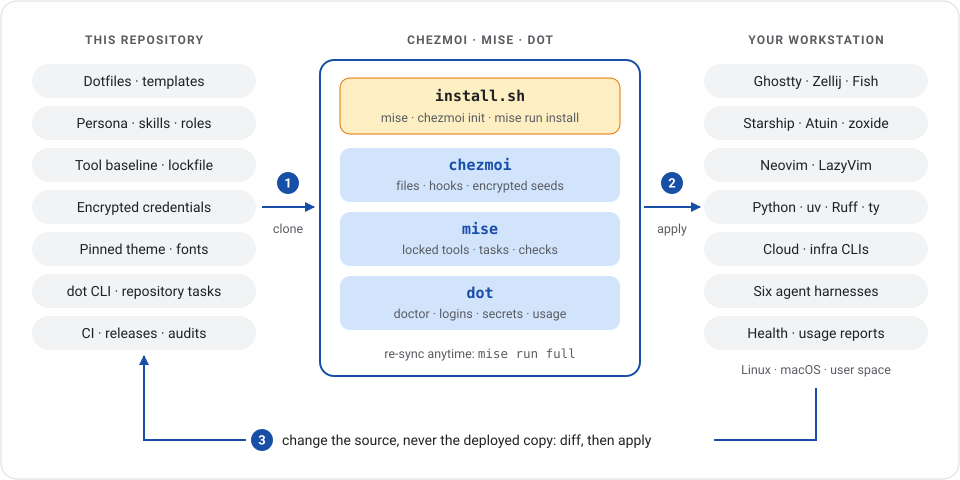
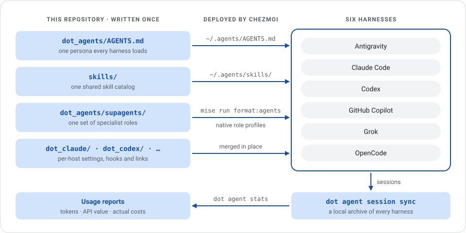

# Dot

My personal dotfiles for **AI-driven, CLI-first development** on Linux and macOS. [Chezmoi](https://www.chezmoi.io/) manages the files; [mise](https://mise.jdx.dev/) manages tools and tasks. Read, borrow, or fork to build your own workstation.

[](https://github.com/fmind/dot/actions/workflows/ci.yml) [](https://github.com/fmind/dot/releases/latest) [](LICENSE)

[Install](#installation) · [Use](#everyday-use) · [Credentials](#credentials) · [Adapt](#adapting-this)

<a href=".github/assets/dot-overview.svg">
  
</a>

## Highlights

- **Terminal:** Fish, Starship, Atuin, zoxide, fzf, Ghostty, and Zellij.
- **Editor:** Neovim with LazyVim, styled with [fmind/theme](https://github.com/fmind/theme).
- **Agents:** Antigravity, Claude Code, Codex, Copilot, Grok, and OpenCode share a persona and [skills](skills/); `dot agent session sync` archives their local sessions for [usage reports](skills/agent-usage/SKILL.md).
- **Development:** Python with uv, Ruff, ty, and pytest, plus cloud and infrastructure tools.
- **Automation:** the `dot` CLI checks workstation health, manages workspaces, and reports agent usage.

## Prerequisites

| Platform            | Requirements                            | CI coverage                            |
| ------------------- | --------------------------------------- | -------------------------------------- |
| Linux x86-64        | glibc 2.39+ (Debian 13 / Ubuntu 24.04+) | Full repository gate and starter tests |
| macOS Apple Silicon | Xcode Command Line Tools                | Templates, Python and starter tests    |

Other platforms are untested. CI checks templates, code, and builds; it does not run the installer end to end.

Install the host prerequisites first; the rest installs in user space:

```bash
# Debian / Ubuntu
sudo apt install -y git curl libatomic1 build-essential gnome-keyring xclip wl-clipboard

# macOS
xcode-select --install
```

The installer requires mise 2026.10.3 or newer and installs it if absent. [Ghostty](https://ghostty.org/docs/install/binary) is the recommended terminal. A container engine is optional.

## Installation

> [!WARNING]
> These are personal dotfiles: [adapt them](#adapting-this) and back up your files first. Setup overwrites managed files without backups. Agents use broad autonomous permissions, and apply automatically trusts configured workspaces and owner-allowlisted repositories. Review the settings and [trust behavior](skills/dot-cli/references/daily-workflows.md#folder-trust) before use.

Read [`install.sh`](install.sh), then:

```bash
git clone https://github.com/fmind/dot.git ~/.local/share/chezmoi
bash ~/.local/share/chezmoi/install.sh
```

Enter **your own** Git name, email, personal-repository email, and GitHub username when prompted; the defaults are mine. Open a new shell and run `dot doctor` to check the installation.

To resume interrupted setup, rerun the installer. Set `SKIP_GIT_PULL=true` to use an existing checkout without fetching upstream. From an initialized checkout, `mise run full` reapplies files and synchronizes locked tools, `dot`, and completions.

### Shell

Ghostty and Zellij launch Fish; your login shell stays unchanged. Fish attaches to Zellij once at startup and returns to a shell when Zellij exits or detaches. In another terminal, run `fish` or set its shell command to `~/.local/share/mise/shims/fish`.

## Everyday use

```bash
dot --help                # Discover commands
dot doctor                # Check workstation health
dot doctor --headroom     # One-line disk and memory check before large work
dot config show           # Inspect effective settings
dot agent stats           # Review agent usage and prompt statistics
dot status --fetch        # Refresh remotes, then show repository status
dot orphan                # List files no longer managed by chezmoi
```

Edit managed files in `~/.local/share/chezmoi`, then preview and apply:

```bash
cd ~/.local/share/chezmoi
mise run diff
mise run apply
```

The [Dot CLI guide](skills/dot-cli/SKILL.md) covers commands, diagnostics, and recovery.

### Dot configuration

Machine-local settings live in `~/.config/dot.yaml` and merge with [built-in defaults](dot/src/fmind_dot/config.py). Configuration selection is `dot --config <path>` → `DOT_CONFIG_PATH` → the default path. A missing default file is fine; a missing explicitly selected file is an error.

Use `dot config edit` to edit settings; it validates them when the editor exits. Alternate `~/.config/dot.*.yaml` profiles are loaded only when selected; these files stay outside Git and chezmoi management.

### Usage and subscription settings

Usage reports distinguish token counts and estimated API value from actual costs. See the [usage guide](skills/agent-usage/SKILL.md) for reports and [subscription settings](skills/agent-usage/references/queries.md#monthly-and-subscription-reports) for renewal dates and charges.

## Repository tasks

Run these from the checkout; `mise tasks` lists every task and alias.

| Command            | Purpose                                                              |
| ------------------ | -------------------------------------------------------------------- |
| `mise run diff`    | Preview dotfile changes                                              |
| `mise run apply`   | Apply files and eligible hooks                                       |
| `mise run full`    | Synchronize files, locked tools, CLI, and completions                |
| `mise run upgrade` | Upgrade dependencies, tools, theme, and plugins; apply and reinstall |
| `mise run all`     | Format, check, test, and build the repository                        |

`all` rewrites formatting but does not deploy. Contributor details: [AGENTS.md](AGENTS.md), [verification](.agents/skills/dot-verify/SKILL.md), and [releases](.agents/skills/dot-release/SKILL.md).

## Agent roles

<a href=".github/assets/agent-layer.svg">
  
</a>

Shared roles (code and security reviewers, content editor, and deep researcher) are available to Antigravity, Claude Code, Codex, Copilot, Grok, and OpenCode. Edit [shared Supagents sources](dot_agents/supagents/), run `mise run format:agents`, then preview and apply the affected chezmoi files. `mise run check:agents` rejects source warnings and missing, changed, or obsolete generated profiles, and shows their diffs. See [cross-harness agents](skills/agent-project/references/cross-harness-agents.md) for invocation, native permission differences, and updating the pinned compiler.

## Agent skills

Setup links this repository's [`skills/`](skills/) into `~/.agents/skills/`, alongside independently installed packages. Restart agent sessions after catalog changes. See [skill authoring](skills/skillify/SKILL.md) and [catalog maintenance](.agents/skills/dot-skills/SKILL.md); upgrades from v6.x, or from releases that shipped `bf-use`, `deleguate-tasks`, or `security-review` (now `bf`, `delegate-tasks`, and `code-security`), need the [retired-link cleanup](.agents/skills/dot-skills/references/installed-links.md#retired-links).

Use `/clipboard` to copy the requested deliverable from the preceding exchange, or `/clipboard <selection>` to choose a result. The [clipboard skill](skills/clipboard/SKILL.md) verifies the copied text using native macOS or ChromeOS/Linux tools.

Other everyday shortcuts: `/full-review` reviews a whole project and applies verified fixes, `/smoke` runs every task and CLI command, `/trim <path>` shortens without losing meaning, `/auth-status` lists expired logins with the exact re-login command, and `/handoff` saves a continuation prompt before `/clear`. For writing, `/draft-mail` creates Gmail drafts only and `/fact-check` verifies claims and links.

## Credentials

### Authentication & Logins

```bash
dot login all             # GitHub, GCP and ADC, then Workspace; skips what is ready, opens the browser when needed
dot login all --check     # Only report which providers need a login (exit 1 if any)
dot login github          # GitHub
dot login workspace       # Google Workspace
dot login gcp             # Google Cloud and ADC
dot login colab           # ADC with Colab scopes, then verify session access
```

GitHub pushes use SSH, even for HTTPS clones: register an SSH key in [GitHub settings](https://github.com/settings/keys). `dot login all` also reconciles GitHub scopes and, when `GWS_PROJECT` or `auth.workspace.project` is set, Workspace APIs and OAuth setup; run `dot setup github` or `dot setup workspace <project-id>` for one step alone. Account selection and scope policy live in the [authentication guide](skills/dot-cli/references/authentication.md).

Agent harnesses use their own logins:

| Harness     | Command                 |
| ----------- | ----------------------- |
| Antigravity | `agy`                   |
| Claude Code | `claude auth login`     |
| Codex       | `codex login`           |
| Copilot     | `copilot login`         |
| Grok        | `grok login`            |
| OpenCode    | `opencode` → `/connect` |

For hooks, notifications, and provider overrides, see [agent harnesses](skills/agent-harnesses/SKILL.md) and [Antigravity](skills/agy/SKILL.md). Add optional MCP servers with [mcp-setup](skills/mcp-setup/SKILL.md).

### Secret Management

Secrets are not exported at shell startup. Hugging Face, Kaggle, and OpenCode use native credential files, seeded only when absent so later logins survive apply. Use `hf auth login`, `kaggle auth login`, or OpenCode's `/connect` for your own accounts. For customer work, select credentials explicitly using the [account override guide](skills/dot-cli/references/authentication.md#customer-overrides-and-isolation).

Supply a personal key to one command with `dot secret run`; PyPI packages publish through Trusted Publishing, not a personal token. Delete any retired `~/.config/dot/secrets/UV_PUBLISH_TOKEN` seed and revoke that token on pypi.org. Personal model integrations default to [GCP Agent Platform with ADC](skills/model-providers/references/gcp-agent-platform.md); OpenCode uses OpenRouter.

```bash
dot secret run STITCH_ACCESS_TOKEN -- <command>
```

The helper preserves existing environment values; an empty value fails instead of loading the personal key. See [scoped credentials](skills/dot-cli/references/authentication.md#scoped-credentials) for supported keys and precedence.

**Encrypted sources:** only the owner's age key decrypts the committed credentials. Without `~/.config/chezmoi/key.txt`, apply skips them; a different key fails decryption. Back up your key. To capture a credential, set its file mode to `0600` and use `chezmoi add --encrypt` (`--create` for native login seeds). Never put secret values in command arguments. Rotate native credentials through their tool and refresh the encrypted seed separately.

**Migrating from shell exports:** apply files and install the updated CLI together (`mise run full`), remove duplicate key exports from `~/.private.fish`, then restart terminals, editors, and agents from a clean login session. Existing processes retain their old credentials; sourcing a file or opening a child shell does not clear them.

## Adapting this

Fork and replace these personal defaults:

1. **Identity:** prompts in [`.chezmoi.toml.tmpl`](.chezmoi.toml.tmpl) and the clone URL in [`install.sh`](install.sh). Use unmanaged `~/.config/git/config.local` for Git overrides and `includeIf` profiles.
1. **Secrets:** replace the age recipient and remove or re-encrypt credential sources before applying; see [Secret Management](#secret-management).
1. **Persona:** edit [`dot_agents/AGENTS.md`](dot_agents/AGENTS.md), which every harness loads.
1. **Workspaces:** change `pull.directories` and `trust.github_owners` in `~/.config/dot.yaml`, plus Claude's directories in [`dot_claude/modify_settings.json`](dot_claude/modify_settings.json) and the personal-checkout `includeIf` directories in [`dot_gitconfig.tmpl`](dot_gitconfig.tmpl), which commit with the personal-repository email. Mise trust is separate: use `mise trust /path/to/mise.toml` or unmanaged `~/.config/mise/conf.d/trust.toml`.
1. **Theme:** change [`.chezmoiexternal.toml.tmpl`](.chezmoiexternal.toml.tmpl); theme files are pinned to an [fmind/theme](https://github.com/fmind/theme) commit that `mise run upgrade` advances.

## Uninstall / rollback

There is no complete uninstaller. Record `chezmoi managed` before removing state: `chezmoi purge` removes chezmoi's source, configuration, and state but leaves deployed files. `mise implode --config` removes mise and its tools. Restore your backups and remove remaining deployed files, shell integration blocks, separately installed CLIs, fonts, and agent data as needed.

To roll back, preserve local edits, check out the previous release tag, and run `mise run full`, then `mise run vim` to restore locked Neovim plugins. Applying files alone does not reinstall previous tool or CLI versions. Newer files, application data, and migrations are not rolled back.

## Security

Report vulnerabilities through [SECURITY.md](.github/SECURITY.md).

## License

[MIT](LICENSE) © Médéric Hurier (Fmind)
