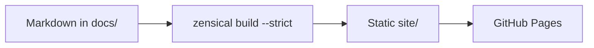

# <Project>

<Project> helps <audience> <achieve an outcome>. Start with the shortest path to a first verified result.

<div class="grid cards" markdown>

- :lucide-rocket: **Get started**

  ---

  Install <Project> and run the first command in five minutes.

  [:octicons-arrow-right-24: Quickstart](index.md#quickstart)

- :lucide-book-open: **Guides**

  ---

  Task-oriented walkthroughs for common goals.

  [:octicons-arrow-right-24: Browse guides](index.md)

- :lucide-library: **Reference**

  ---

  Configuration, commands, and API details.

  [:octicons-arrow-right-24: Open reference](index.md)

- :lucide-lightbulb: **Concepts**

  ---

  Design decisions, trade-offs, and how the parts fit together.

  [:octicons-arrow-right-24: Understand the design](index.md#how-it-works)

</div>

## Quickstart

=== "uv"

    ```bash
    uv add <package>
    ```

=== "pip"

    ```bash
    pip install <package>
    ```

Run the first command and compare its output:

```console
$ <command> --version
<expected output>
```

!!! tip "Next step"

    Replace the card links above with real pages; strict builds reject links to missing files and anchors.

## How it works


