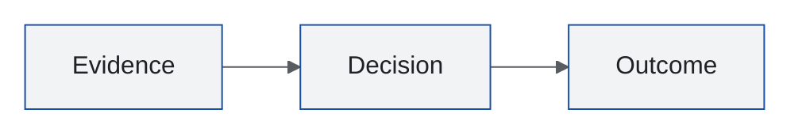

# Fmind Visual Theme

The default palette comes from [fmind/theme](https://github.com/fmind/theme/blob/main/README.md). Use these snippets when a renderer needs the theme in its own syntax.

Use generous space, crisp geometry, restrained blue, and evidence-led labels. Avoid gradients, decorative illustration, generic AI imagery, and dense dashboards unless the content requires them.

## Brand Palettes

### Fmind (Articles and Documents)

Calm, exact, spacious, technically grounded. Crisp geometry and editable diagrams over decorative imagery.

| Role            | Color     | Use                                   |
| --------------- | --------- | ------------------------------------- |
| Canvas          | `#FFFFFF` | Main background; labels on dark fills |
| Panel           | `#F1F3F4` | Groups, panels, neutral surfaces      |
| Border          | `#9AA0A6` | Decorative boundaries; not small text |
| Muted           | `#595D62` | Secondary text and comments           |
| Foreground      | `#202124` | Body text, variables, punctuation     |
| Primary         | `#174EA6` | Headings, links, keywords, calls      |
| Focus           | `#4285F4` | Active controls and accents           |
| Selection       | `#D2E3FC` | Selected rows and primary containers  |
| Error           | `#A50E0E` | Error text and dark error fills       |
| Error accent    | `#EA4335` | Markers and underlines                |
| Error surface   | `#FAD2CF` | Removed or failed regions             |
| Warning         | `#934900` | Warning text, numbers, constants      |
| Warning accent  | `#E37400` | Search and attention fills            |
| Highlight       | `#FBBC04` | Active tabs and current matches       |
| Warning surface | `#FEEFC3` | Changed or caution regions            |
| Success         | `#0D652D` | Strings, success text, additions      |
| Success accent  | `#34A853` | Success markers and fills             |
| Success surface | `#CEEAD6` | Added regions and actor nodes         |
| Type            | `#681DA8` | Types, builtins, secondary emphasis   |
| Information     | `#00636D` | Informational text and diagnostics    |

Use dark shades for text and bright shades for fills or accents. Filled labels use charcoal or white according to contrast; require at least 4.5:1 for text on its actual panel, selection, or highlight. Reinforce meaning with labels, shape, line style, and typography. Keep text upright by default; use real bold and italic faces deliberately, never synthetic slanting.

Use Google Sans for headings and body text and Google Sans Code for code. Use regular (400), semibold (600), and bold (700) weights; reserve code fonts for code, paths, commands, and protocol fields. Copy the font files and their OFL notices into standalone deliverables and verify loading before export. Official sources: [Google Sans](https://github.com/googlefonts/googlesans) and [Google Sans Code](https://github.com/googlefonts/googlesans-code).

### Bleeding Agent (Media and Podcast)

Forensic, sharp, darkly playful. Cyan, magenta, and red diagnostics; black-box imagery, terminal texture, warning marks, protocol traces, failure boundaries.

| Token      | Value     | Token   | Value     |
| ---------- | --------- | ------- | --------- |
| Background | `#061321` | Cyan    | `#00E5FF` |
| Panel      | `#0B2034` | Magenta | `#FF2AA1` |
| Foreground | `#F7FAFC` | Red     | `#FF3158` |
| Muted      | `#A7BBCB` | Border  | `#16364F` |

Bleeding Agent shares the Google Sans and Google Sans Code typography above while retaining its separate media palette and existing reviewed logo/banner.

## Portable Mermaid Frontmatter

Use Mermaid's `base` theme because it is customizable. This form stays inside the Mermaid source and works in `.mmd` files and Markdown fences when the target renderer supports frontmatter.

For a renderer without Mermaid frontmatter support, move the same configuration into its site-level Mermaid configuration. Load Google Sans before rendering and keep its selection in root-level `config.fontFamily` so label measurements remain stable.

## D2

An Fmind article diagram imports [diagram.d2](diagram.d2) and uses its classes on a light surface. The diagram surface remains light because the site supports reader-selected light and dark themes, where a light figure still reads as a bounded panel.

| Class       | Means                                           |
| ----------- | ----------------------------------------------- |
| `group`     | A labelled boundary holding other shapes        |
| `container` | A major building block the article names        |
| `component` | A leaf part inside a container                  |
| `actor`     | A human or calling system where the flow enters |
| `external`  | Something outside the boundary being described  |
| `step`      | One numbered stage of a sequence                |
| `terminal`  | Where a flow starts or stops                    |

Elsewhere, start from a built-in D2 theme and use `theme-overrides` or `dark-theme-overrides` under `vars.d2-config`. Supply all eight D2 font slots from static TTF faces: Google Sans for `--font-regular`, `--font-italic`, `--font-semibold`, and `--font-bold`; Google Sans Code for `--font-mono`, `--font-mono-italic`, `--font-mono-semibold`, and `--font-mono-bold`. Missing slots fall back to D2 fonts. Instantiate variable fonts at the intended weights before assigning them to these slots; one variable font reused for every slot can render every weight as regular. In Pub, `pub render diagram` loads these faces from `assets/fonts/`.
