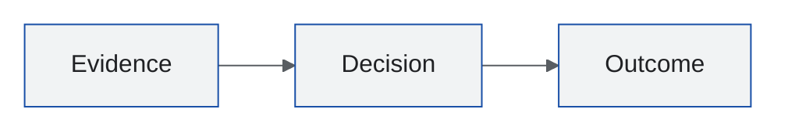

# Fmind Design in Renderers

`~/.agents/DESIGN.md` owns the Fmind tokens, roles, components, and rules; its source is [fmind/theme DESIGN.md](https://github.com/fmind/theme/blob/main/DESIGN.md). Read it first. This guide only maps it into renderer syntax, so a design change updates DESIGN.md, then the adapters below and the templates that carry native values.

## Exports

For CSS-based targets, generate values instead of copying them; the format is alpha, so pin the CLI version and review the output:

```bash
npx @google/design.md@0.4.0 export --format css-tailwind ~/.agents/DESIGN.md  # Tailwind v4 @theme
npx @google/design.md@0.4.0 export --format css-vars --prefix fmind ~/.agents/DESIGN.md  # plain CSS
npx @google/design.md@0.4.0 export --format dtcg ~/.agents/DESIGN.md  # Figma, Style Dictionary
```

## Mermaid

Use Mermaid's `base` theme because it is customizable. This frontmatter stays inside the Mermaid source and works in `.mmd` files and Markdown fences when the target renderer supports frontmatter.



For a renderer without Mermaid frontmatter support, move the same configuration into its site-level Mermaid configuration. Load Google Sans before rendering and keep its selection in root-level `config.fontFamily` so label measurements remain stable.

## SVG Illustrations

README and user-doc illustrations copy [illustration.svg](../../diagrams-as-code/references/svg/templates/illustration.svg). Its `<style>` maps DESIGN.md roles to classes: `chip` (panel items), `box` (primary-bordered system boundary), `tile` (selection fill, primary code title), `config` (warning surface), `err` (error surface), `step`, `flow`, and `arrowhead` (primary badges and arrows), `mask` (canvas behind captions), and `label` and `muted` (secondary text). The outer card stays white with a light `#DADCE0` border so the art reads on dark README themes. For a customer brand, swap these values and font names only.

## D2

[diagram.d2](../templates/diagram.d2) implements the DESIGN.md `diagram-*` components as D2 classes (`group`, `container`, `component`, `actor`, `external`, `step`, `terminal`) on a light surface. Fmind diagrams import it and use its classes instead of declaring colors.

Elsewhere, start from a built-in D2 theme and use `theme-overrides` or `dark-theme-overrides` under `vars.d2-config`. Supply all eight D2 font slots from static TTF faces: Google Sans for `--font-regular`, `--font-italic`, `--font-semibold`, and `--font-bold`; Google Sans Code for `--font-mono`, `--font-mono-italic`, `--font-mono-semibold`, and `--font-mono-bold`. Missing slots fall back to D2 fonts. Instantiate variable fonts at the intended weights before assigning them to these slots; one variable font reused for every slot can render every weight as regular. In Pub, `pub render diagram` loads these faces from `assets/fonts/`.

## Typst

[deck.typ](../templates/deck.typ) declares the canvas, panel, foreground, muted, primary, and border roles as Typst colors and the DESIGN.md fonts; keep its role names aligned with the tokens.
